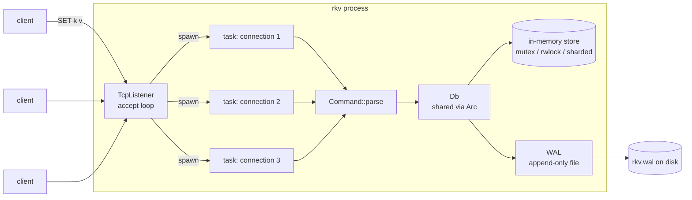
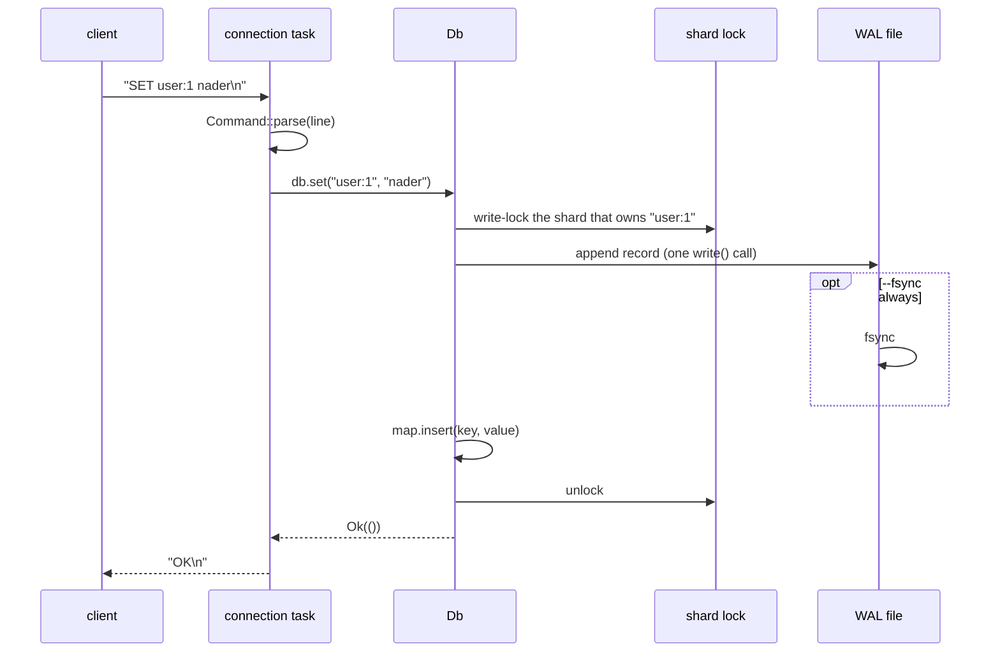
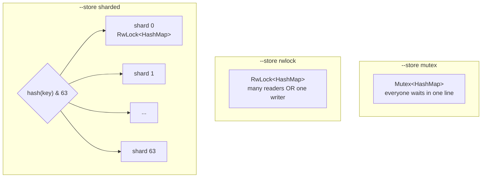
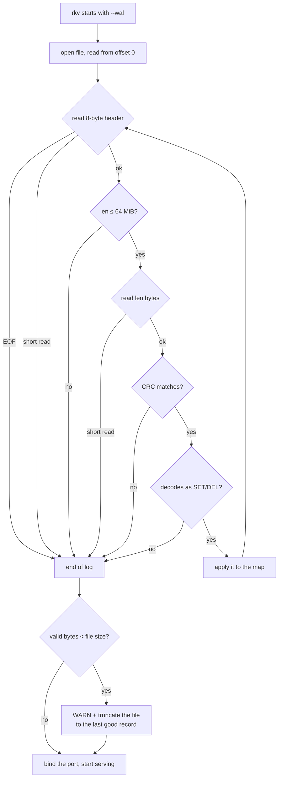

# How rkv works

This is a walkthrough of the system as of tag `ep03`: what happens to a request
from the moment it arrives on a socket until it is in memory and on disk, and
how the server rebuilds its state after a crash.

For how it's measured and tested, see [PERFORMANCE.md](PERFORMANCE.md).

---

## 1. The big picture



| Module | File | Job |
|--------|------|-----|
| CLI | `src/main.rs` | Parse flags, open the `Db` (replaying the WAL), bind the port, run the server. |
| Server | `src/server.rs` | Accept TCP connections; one tokio task per client reads lines, executes them, writes replies. |
| Protocol | `src/command.rs` | Turn one text line into a `Command` (`PING` / `GET` / `SET` / `DEL`) or a `ParseError`. |
| Storage | `src/db.rs` | `Db`: a cheaply clonable handle to the in-memory map(s) plus the optional WAL. |
| Durability | `src/wal.rs` | Append records to the log, fsync by policy, replay and repair the log on startup. |
| Benchmark | `src/bin/rkv-bench.rs` | Load generator; can spawn and compare server configurations. |

---

## 2. The protocol

One command per line, one reply per line. It's plain text on purpose: you can
talk to the server with `nc` (or bash's `/dev/tcp`) and read everything on the wire.

| Request | Reply | Notes |
|---------|-------|-------|
| `PING` | `PONG` | |
| `SET <key> <value...>` | `OK` | The value is **the rest of the line**, so spaces are kept. |
| `GET <key>` | the value, or `(nil)` | |
| `DEL <key>` | `1` if it existed, else `0` | |
| anything else | `ERR <reason>` | e.g. `ERR unknown command 'FOO'`, `ERR wrong number of arguments for 'GET'` |
| write that couldn't be logged | `ERR storage: <io error>` | The write was **not** applied. |

Command names are case-insensitive. Keys can't contain whitespace. Values can't
contain a newline: the protocol isn't binary-safe yet, which is the price of
being `nc`-friendly.

```text
$ nc 127.0.0.1 6380
SET greeting hello world
OK
GET greeting
hello world
DEL greeting
1
GET greeting
(nil)
```

---

## 3. Life of a request



Step by step:

1. **Accept.** `server::run` loops on `listener.accept()` and `tokio::spawn`s a
   task per connection. Each task gets its own clone of `Db`, which is just an
   `Arc` pointing at the same shared state.
2. **Read a line.** The task wraps the socket in a `BufReader` and awaits
   `next_line()`. While a client is idle, its task is parked and costs no CPU
   (the CPU test checks that 200 idle connections use 0 ms of CPU).
3. **Parse.** `Command::parse` splits off the command name, uppercases it, and
   validates the argument count. Errors become `ERR ...` replies; the
   connection stays open.
4. **Execute.**
   - `GET` takes a **read** lock and clones the value. Values are `bytes::Bytes`,
     so "cloning" is a reference-count increment, not a copy, and the lock is
     held for nanoseconds.
   - `SET` / `DEL` take a **write** lock on the map that owns the key, append to
     the WAL (if enabled), then change the map (section 5 explains the order).
5. **Reply.** The reply plus `\n` goes out in one `write_all`. `TCP_NODELAY` is
   on, so the kernel sends small replies right away instead of waiting to batch
   them (Nagle's algorithm).

A connection ends when the client closes it. Invalid UTF-8 or a socket error
also ends that connection only; other clients are unaffected (there's a test
for this).

---

## 4. Storage: three ways to share a HashMap

All data lives in `HashMap<String, Bytes>`. The question ep02 answers is how
many threads can use it at once. `--store` picks the strategy:



- **mutex**: simplest. Every operation, even a read, is exclusive.
- **rwlock**: reads can run in parallel. In practice, every reader still
  updates the lock's reader counter, so the lock's cache line bounces between
  cores and it doesn't scale better than a mutex (the measurements are in
  PERFORMANCE.md).
- **sharded**: 64 independent `RwLock<HashMap>`s. A key always maps to the same
  shard (`RandomState::hash_one(key) & 63`), so operations on different keys
  usually touch different locks and different cache lines. In memory this
  scales to ~86 M ops/s on 16 threads, versus ~5 M for a single mutex.

`Db` hides the choice: `get`, `set`, and `del` match on the variant, and a small
`MapGuard` enum turns "lock whichever map owns this key for writing" into one
call (`write_map(key)`), so `set` and `del` are written once for all three.

> Over TCP all three run at about the same speed (~135k ops/s). A request costs
> ~30 µs of syscalls and the lock costs ~50 ns, so the network hides the lock.
> The difference only shows when the network isn't the bottleneck.

---

## 5. Durability: the write-ahead log

Started with `--wal <path>`. Without it, `rkv` is purely in-memory.

### Record format

```text
┌──────────┬──────────┬──────────────────────────────────────────────┐
│ len: u32 │ crc: u32 │ payload (len bytes)                          │
└──────────┴──────────┴──────────────────────────────────────────────┘
                       ┌────────┬──────────────┬───────┬────────────┐
            payload =  │ op: u8 │ key_len: u32 │ key   │ value      │
                       └────────┴──────────────┴───────┴────────────┘
   op: 1 = SET, 2 = DEL (no value)     integers are little-endian
   crc = CRC-32 of the payload
```

`len` says how much to read, `crc` says whether what was read is intact, and
`key_len` separates the key from the value.

### The write path, and why it's ordered this way

For every `SET`/`DEL`, inside `Db`:

```text
lock the map that owns the key
  └─ append the record to the WAL         ← a single write() syscall
       └─ fsync, if --fsync always
  └─ apply the change to the HashMap
unlock
reply "OK"
```

- **Log, then apply.** If the append fails, the map isn't touched and the client
  gets `ERR storage`. The server never acknowledges a write it didn't log.
- **Log while holding the key's lock.** Two clients doing `SET k a` and `SET k b`
  at the same time are serialized by that lock, so they reach the log in the
  same order they reach memory. If the lock were released before logging, memory
  could end with `b` and the log with `a`, and a restart would bring back the
  wrong value. Writes to different shards can be logged in any order, which is
  fine because they don't affect each other.
- **Lock order is always map/shard lock → WAL mutex.** The background fsync
  thread takes only the WAL mutex. No path takes them in the opposite order, so
  they can't deadlock.
- **One `write()` per record, no userspace buffer.** Once `write` returns, the
  bytes are in the OS page cache. If the *process* dies (`kill -9`, panic,
  OOM-kill), the OS still writes them to disk. A `BufWriter` would lose them.

### fsync policies

`write()` gets a record to the OS. `fsync` gets it to the disk. The difference
only matters if the **machine** dies:

| `--fsync` | When fsync happens | Survives `kill -9` | Survives power loss | Cost (see PERFORMANCE.md) |
|-----------|--------------------|:------------------:|---------------------|------|
| `always` | before every `OK` | ✓ | ✓ every acknowledged write | ~9× fewer ops/s |
| `every-sec` (default) | background thread, once per second if anything was written | ✓ | loses up to ~1 s | ~5–10% |
| `never` | whenever the OS decides | ✓ | loses whatever wasn't flushed | ~5–10% |

The `every-sec` thread holds a `Weak` reference to the WAL, so it exits by
itself once the WAL is dropped.

### Recovery: what happens on startup



- **Torn tail.** If the server died in the middle of writing a record, the file
  ends with a partial record. Replay finds it through a short read or a CRC
  mismatch, stops there, and **truncates** it, so new records are appended
  right after the last good one instead of after garbage.
- **Garbage length.** A corrupted `len` could claim 4 GB; anything over 64 MiB
  is treated as the end of the log instead of being allocated.
- **Bind after replay.** The port only opens once recovery is done, so any
  client that can connect sees the recovered state.

`scripts/crash-demo.sh` shows all of this live: writes, `kill -9`, restart,
data back, then a hand-made torn record being detected and cut off.

### Known limits of the current WAL

- **The log grows forever.** Every `SET` is appended, even overwrites of the same
  key, and replay reads all of it. ep04 (LSM + compaction) fixes this.
- **`--fsync always` is slow and blocks readers.** Each write holds the shard
  lock *and* the WAL mutex through its fsync. Group commit (one fsync covering
  many waiting writers) is the standard fix.
- **Corruption in the middle of the log** (bit rot, not a crash) is handled like
  a torn tail: everything after it is dropped, with a `WARN`.

---

## 6. Concurrency model in one page

| Thing | Runs on | Shared state it touches | How it's protected |
|-------|---------|-------------------------|--------------------|
| accept loop | one tokio task | the listener | owned by that task |
| connection handler | one tokio task per client | `Db` (clone of an `Arc`) | locks inside `Db` |
| `GET` | the caller's task | one map | read lock (shared) |
| `SET` / `DEL` | the caller's task | one map + the WAL file | write lock on the map, then the WAL mutex |
| WAL fsync (`every-sec`) | a dedicated OS thread | the WAL file | WAL mutex + `dirty` flag |

Locks are `std::sync` locks, not `tokio::sync`. That's fine because no lock is
ever held across an `.await`: every critical section is a few hash-map
operations (plus a blocking `write`/`fsync` when the WAL is on).

What the tests guarantee (`tests/concurrency.rs`, run on all three stores): no
lost writes, no torn values (a `GET` never returns half of one write and half of
another), read-your-writes per connection, and no deadlocks under 100 concurrent
clients.

---

## 7. Code map

```text
src/
├── main.rs          CLI flags → Db::open / Db::new → bind → server::run
├── lib.rs           module list (so tests and benches can use the crate)
├── server.rs        accept loop, per-connection task, execute(), replies
├── command.rs       Command enum + line parser (+ unit tests)
├── db.rs            Db, StoreKind, the three stores, MapGuard, WAL hookup
├── wal.rs           record encode/decode, append + fsync, replay + truncate (+ unit tests)
└── bin/rkv-bench.rs load generator, --compare stores|fsync
benches/store.rs     criterion: T threads hammering Db in memory
tests/
├── server.rs        basic protocol over TCP
├── concurrency.rs   lost writes, torn values, read-your-writes, deadlock (all stores)
├── memory.rs        counting allocator: per-key overhead, leaks, connections
├── cpu.rs           idle CPU, CPU per request
└── crash.rs         kill -9 the real binary, restart, check acknowledged writes
scripts/
├── crash-demo.sh    ep03 live demo
└── test-report.sh   all tests + benchmarks → results/<tag>.md
```

---

## 8. Where it's going

| Episode | Change | Effect on this design |
|---------|--------|-----------------------|
| ep04 | `Storage` trait; memtable (`BTreeMap`) flushed to SSTables; tombstones; compaction | The WAL only has to cover the memtable and gets truncated after each flush. Reads check the memtable, then SSTables newest first. |
| ep05 | Leader ships WAL entries with sequence numbers to followers | The WAL record becomes the replication unit; followers can serve stale reads. |
| ep06 | Raft roles, terms, randomized election timeouts, `RequestVote` | Automatic leader failover in under 2 s. |
| ep07 | `AppendEntries`, commit index; the storage engine becomes Raft's state machine | A write is acknowledged only once a majority has it, so killing nodes loses no acknowledged write. |
