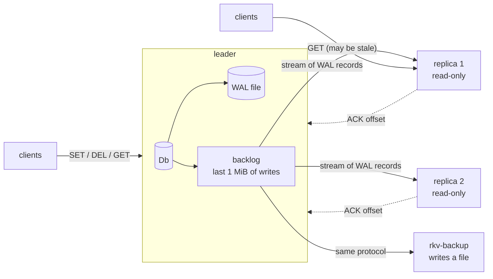
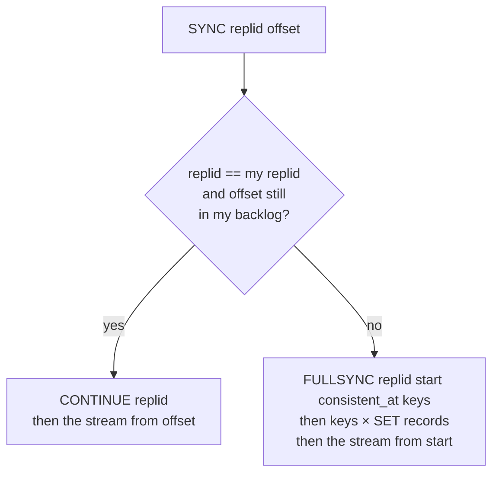
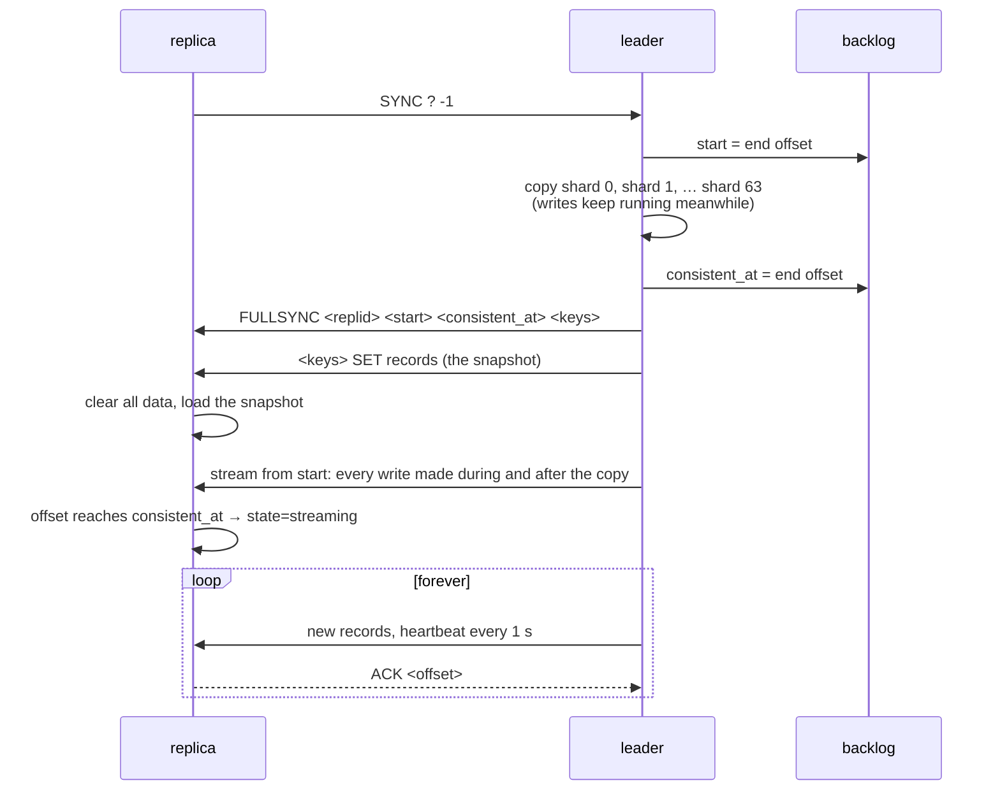
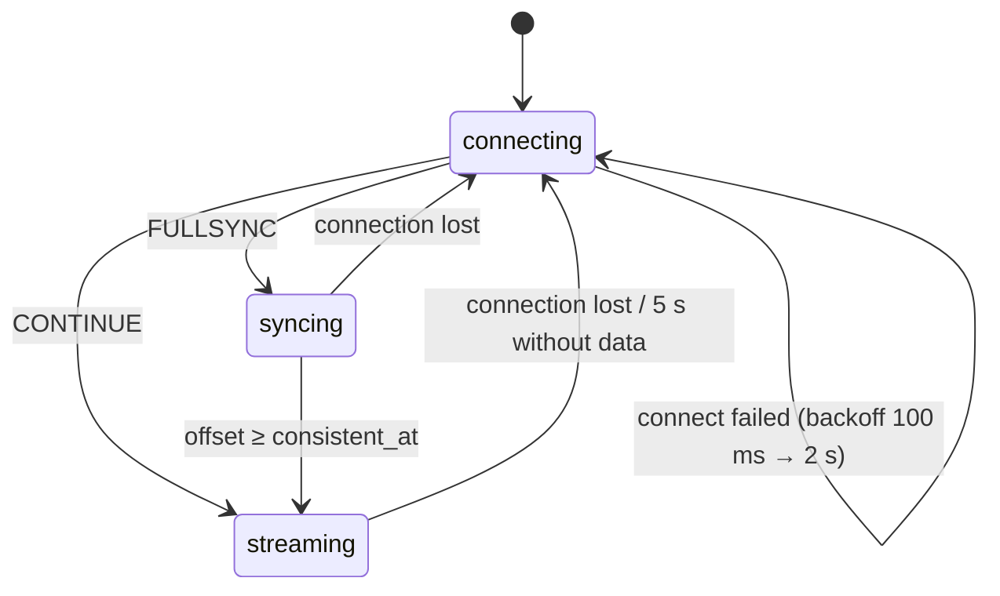
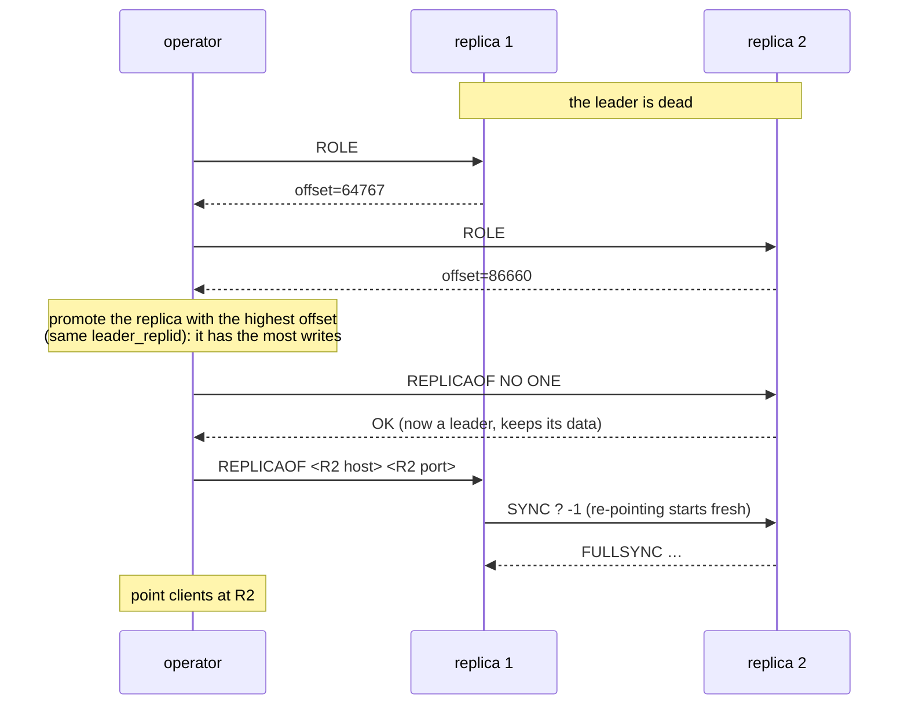
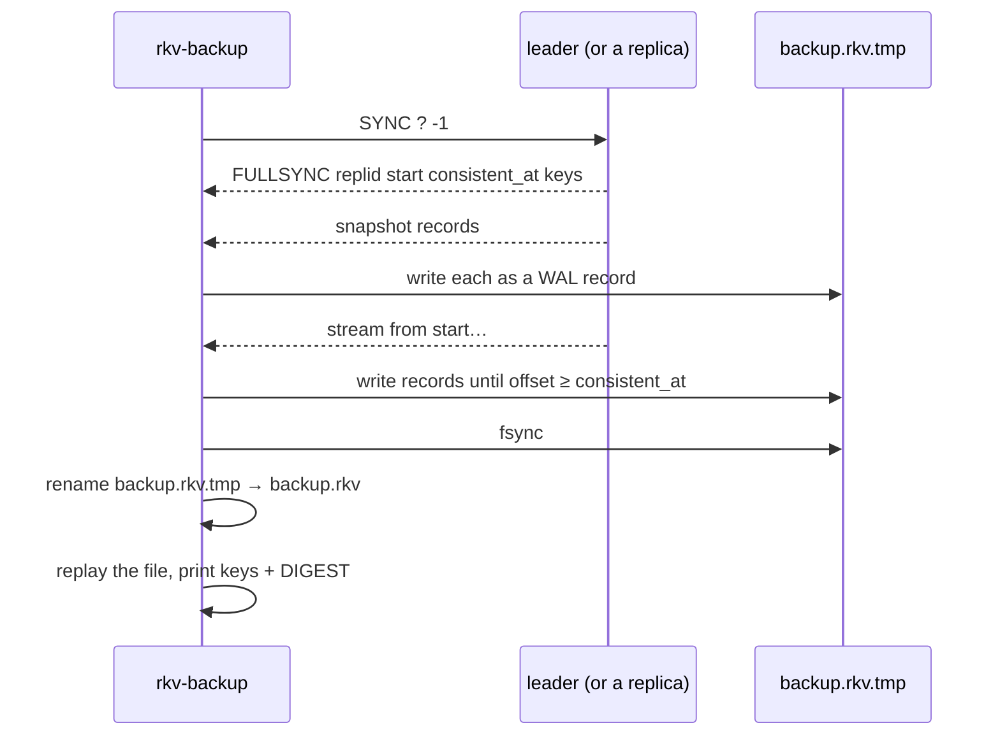

# Replication and backup

This document covers how rkv copies data from one server to others (tag `ep04`):
the leader → replica flow, what happens on every kind of failure, how
failover works, and how backups are taken and restored.

For the single-node design (request path, stores, WAL), see
[ARCHITECTURE.md](ARCHITECTURE.md). For measurements, see
[PERFORMANCE.md](PERFORMANCE.md#8-replication-ep04).

---

## 1. The big picture



- **One leader takes all writes.** Replicas reject `SET`/`DEL` with
  `ERR READONLY` and can serve `GET`s.
- **Replication is asynchronous.** The leader replies `OK` as soon as the write
  is in its own memory and WAL. Replicas get it a moment later (about a
  millisecond on loopback). A read on a replica can be stale, and a leader
  crash can lose writes the replicas never received (§6).
- **Everything on the wire uses the WAL record format** from ep03:
  `[len][crc][op][key][value]`. The stream, the snapshot, and backup files are
  all WAL records, so a backup file *is* a WAL.
- **Failover is manual** (`REPLICAOF NO ONE`). Automatic leader election is
  ep06/ep07 (Raft).

Starting a cluster:

```sh
rkv --addr 127.0.0.1:6380                                      # leader
rkv --addr 127.0.0.1:6381 --replica-of 127.0.0.1:6380          # replica
rkv --addr 127.0.0.1:6382 --replica-of 127.0.0.1:6380 --wal r2.wal   # replica with its own WAL
```

---

## 2. Commands

| Command | Where | Reply |
|---------|-------|-------|
| `ROLE` | any node | one line of `key=value` fields; see below |
| `REPLICAOF <host> <port>` | any node | `OK`; becomes a replica of that node (§7) |
| `REPLICAOF NO ONE` | replica | `OK`; stops replicating and accepts writes (promotion) |
| `DBSIZE` | any node | number of keys |
| `DIGEST` | any node | 16 hex digits: hash of the whole data set, independent of order and store kind. Equal digests mean equal data. |
| `SYNC <replid\|?> <offset\|-1>` | sent by replicas | turns the connection into a replication stream (§4) |
| `ACK <offset>` | sent by replicas | only valid on a replication stream |

`ROLE` on a leader:

```text
leader replid=80227ed2… offset=88 full_syncs=2 partial_syncs=0 replicas=2 replica=127.0.0.1:54263,acked=88,lag=0 replica=…
```

`ROLE` on a replica:

```text
replica replid=b99d9d45… leader=127.0.0.1:6380 state=streaming leader_replid=80227ed2… offset=88 consistent_at=0
```

| Field | Meaning |
|-------|---------|
| `replid` | this node's own stream ID: random, new on every start |
| `offset` (leader) | end of this node's write stream, in bytes |
| `acked`, `lag` | last offset a replica confirmed, and how many bytes it is behind |
| `state` | `connecting` → `syncing` → `streaming` (§5) |
| `leader_replid`, `offset` (replica) | which leader stream this replica is a copy of, and how far into it |
| `consistent_at` | for a full sync: the offset at which the copy becomes a consistent point in time |

---

## 3. The stream: offsets and the backlog

Every write the leader applies is encoded once (`wal::encode_set` /
`encode_del`) and, while the key's lock is still held, appended to:

1. the WAL, if `--wal` is on (ep03, unchanged), then
2. the **replication backlog** (`src/repl/backlog.rs`).

```text
   offset:  0         26        52              104
            ├─────────┼─────────┼───────────────┼──────► grows forever
   stream:  │ SET a 1 │ SET b 2 │ SET c hello…  │ DEL a │ …
            └─────────┴─────────┴───────────────┴───────┘
                       ▲                                 ▲
             oldest byte still in the backlog       end offset (ROLE offset=)
             (older bytes evicted)
```

- **The offset is a byte position in the leader's write stream.** A replica
  remembers the offset it has applied up to. Offsets only mean something
  together with the leader's `replid`.
- **The backlog keeps the last `--repl-backlog` bytes** (default 1 MiB). It's
  a ring buffer: once it's full, the oldest bytes are evicted, but offsets
  keep growing. The newest record is always kept whole, even if it alone is
  bigger than the capacity.
- **Same ordering rule as the WAL.** The push happens while holding the
  key's lock, so two writes to the same key reach the stream in the order they
  reached memory. Replicas apply the stream in order, so they end up with the
  same value. Writes to different keys may interleave differently than in
  memory, but they don't affect each other.
- **The backlog is created when the first replica attaches**, as in Redis.
  Until then the write path does no extra work, and ep02/ep03 numbers don't
  change.
- Sender tasks wait on a `tokio::sync::watch` of the end offset. A slow replica
  never blocks writers: if it falls behind by more than the backlog, it gets
  disconnected and starts over with a full sync.

---

## 4. The handshake: full sync or partial resync

A replica opens a normal client connection to the leader and sends one line:

```text
SYNC ? -1                 "I have nothing"
SYNC <replid> <offset>    "I have your stream <replid> up to <offset>"
```

From then on, that connection is a replication stream and no longer a client.



### Partial resync (`CONTINUE`)

Used after a network blip: the replica is still alive, still has its data,
and the bytes it missed are still in the leader's backlog. The leader only
sends what's missing. The leader's `ROLE` shows `partial_syncs` going up.

### Full sync (`FULLSYNC`)

Used when the replica is new or restarted, when it's following a different
leader, when the leader restarted (so its `replid` changed), or when the
missed bytes were already evicted from the backlog.



### Why a "fuzzy" snapshot is correct

The leader doesn't stop writes while it copies its data. It copies one shard at
a time, each under that shard's read lock for just as long as the copy takes.
Shard 0 and shard 63 are copied at different moments, so the snapshot taken on
its own may be a state the leader **never** had.

Here's why it still works. Every record is a **blind write**: `SET k v` sets
`k` to `v` regardless of what was there, and `DEL k` removes `k` regardless.
Take a key `k`:

- If `k` was written after `start`, the stream from `start` contains that
  write. Replaying it overwrites whatever the snapshot had for `k`, and the
  *last* such write is the leader's current value.
- If `k` wasn't written after `start`, it didn't change during the copy, so
  the snapshot already has its current value.

Either way, once the replica has applied the stream past every write made
during the copy, every key has the leader's value. That point is
`consistent_at`, the end offset when the copy finished. Databases use the same
argument for "fuzzy checkpoints" (ARIES; Postgres base backups use a "minimum
recovery point" in the same way).

The replica reports `state=syncing` until it reaches `consistent_at`. Reads
before that can return a mix of old and new data. `rkv-backup` waits until it
reaches `consistent_at` before writing its file (§8).

This is tested, not just argued: `tests/backup.rs` has writers keep updating
pairs `(a_i, b_i)` in order during a backup and checks that every restored
pair is a state that really existed. If the replay to `consistent_at` is
removed from `rkv-backup`, that test fails.

### Why `replid` changes on every start

Suppose the leader runs with `--fsync every-sec` and loses power. On restart,
it may be missing the last second of writes, which a replica might already
have applied. If the restarted leader kept its old `replid`, the replica would
send `SYNC <replid> 5000`, the leader would continue from 5000 in a *different*
history, and the two would silently diverge. A new `replid` on every start
makes that replica fall back to a full sync, and it drops whatever the new
leader doesn't have.

---

## 5. The replica's loop



`src/repl/replica.rs`, one task per replica:

1. Connect and send `SYNC` with the last `(leader_replid, offset)` it
   finished, or `SYNC ? -1` if it has none.
2. For `FULLSYNC`: clear all data, then load the snapshot. `leader_replid`
   stays unset until the whole snapshot is loaded, so if the connection drops
   halfway, the next attempt is another full sync rather than "resuming" a
   half-loaded copy.
3. Apply each streamed record through the normal `Db` path. If the replica has
   its own `--wal`, that path logs it there too. If the replica has replicas of
   its own, it pushes the record to its own backlog, so chains like
   L → R1 → R2 work.
4. A separate task sends `ACK <offset>` within 100 ms of applying something,
   and once a second when idle. It runs in its own task because reading a
   record must never be interrupted halfway through.
5. If nothing arrives for 5 s (the leader sends a heartbeat every 1 s), or
   the connection breaks, or applying fails, go back to step 1. The retry
   delay grows from 100 ms up to 2 s.

On the wire, a **heartbeat** is an 8-byte record header with length 0 and CRC 0.
No real record is that short (a payload has at least an op byte and a 4-byte
key length), so it can't be confused with data.

---

## 6. What happens when things fail

| Failure | What happens | Data |
|---------|--------------|------|
| Replica restarts | Its `leader_replid` is in memory only, so it sends `SYNC ? -1` and full syncs. | Complete again once `state=streaming`. |
| Network blip (replica stays up) | It reconnects with `SYNC <replid> <offset>`; the leader sends `CONTINUE` and only the missed bytes. | Nothing lost. |
| Replica falls behind more than `--repl-backlog` | The leader disconnects it (`replica too far behind`); it reconnects and full syncs. | Nothing lost; the full sync costs a snapshot. |
| Leader restarts | It comes back with a new `replid`; replicas full sync from it. | Replicas end up exactly like the restarted leader, including losing writes it lost. |
| Leader dies for good | Replicas keep serving reads (stale) and retry the connection; writes fail until an operator promotes one (§7). | Writes the leader acknowledged but hadn't sent yet are **lost**. On loopback that window is about a millisecond. |
| Replica partitioned away, then the leader dies | That replica is far behind; promoting it loses everything acknowledged since the partition. | See the demo (`scripts/repl-demo.sh`, step 5): **1000 acknowledged writes** lost if the wrong replica is promoted. |
| Corrupted bytes on the wire | The CRC check fails, so the replica drops the connection and reconnects. | Nothing applied from the bad record. |

What this design deliberately does **not** solve (this is what ep06/ep07 are for):

- **Acknowledged writes can be lost on failover**, because the leader doesn't
  wait for any replica. Making the leader wait for one replica (semi-sync, like
  Redis `WAIT`) narrows the window. Waiting for a majority (Raft) closes it.
- **Nobody picks the new leader.** An operator has to run `REPLICAOF NO ONE`,
  and picking the wrong replica loses data.
- **Split brain.** If the old leader comes back, nothing stops it from taking
  writes alongside the promoted one. Raft's terms are what prevent that.
- **No partitioning.** Every node holds every key.

---

## 7. Manual failover



1. Run `ROLE` on every replica. Among those with the same `leader_replid`,
   pick the **highest `offset`**: it has received the most of the old
   leader's writes.
2. `REPLICAOF NO ONE` on it. It stops its replication task, accepts writes, and
   keeps all its data.
3. `REPLICAOF <host> <port>` on every other replica, pointing at the new
   leader. Each does a full sync: `REPLICAOF` always starts a fresh sync, and
   the new leader's stream has a different `replid` anyway. (Redis avoids this
   with a second replication ID kept across promotion; rkv keeps it simple.)
4. Move clients to the new leader.

`REPLICAOF <host> <port>` can also turn a leader into a replica. Its first full
sync **replaces all of its data** with the new leader's.

---

## 8. Backups

`rkv-backup` (`src/bin/rkv-backup.rs`) is a client that speaks the replica
protocol. The server has no backup-specific code.

```sh
rkv-backup snapshot --from 127.0.0.1:6380 --out backup.rkv   # consistent copy, then exit
rkv-backup follow   --from 127.0.0.1:6380 --out live.rkv     # copy, then keep appending
rkv-backup verify backup.rkv                                 # records, keys, digest, torn bytes
```

### snapshot



- **Consistent.** It keeps writing streamed records until `consistent_at`, so
  the file is the leader's exact state at one moment, even while clients keep
  writing.
- **Atomic.** It writes to `<out>.tmp`, fsyncs, then renames. If it crashes,
  `<out>` is either the previous backup or the complete new one.
- **Checkable.** It prints the same `digest=` that `DIGEST` returns, so you
  can compare a backup taken from an idle server with the server itself.
- **Works against a replica too.** Pointing `--from` at a replica takes load
  off the leader.

### follow

This is a continuous backup. It takes a snapshot as above, then appends every
new record to the same file, one `write` per record (like the WAL), with an
fsync once a second. If the connection drops, it exits with an error naming the
last offset. The file stays valid up to its last complete record: a torn tail
from a crash is cut off on restore, just like after an ep03 crash.

### verify

`verify` replays the file read-only and prints `records`, `keys`, `digest`,
`valid_bytes` and `torn_bytes`. It exits with 0 if the file is clean and 2 if
it ends in an incomplete or corrupt record.

### Restore

Because a backup file is a WAL, restoring is starting a server on a copy of it:

```sh
cp backup.rkv restored.wal
rkv --wal restored.wal          # replay, then serve; DIGEST matches the backup's digest
```

Work on a copy, because the server appends its new writes to that file. To
rebuild a whole cluster, restore the leader this way, then start replicas with
`--replica-of`. They full sync from it.

---

## 9. Configuration

| Flag | Default | Meaning |
|------|---------|---------|
| `--replica-of <host:port>` | *(none: leader)* | start as a replica of that node |
| `--repl-backlog <bytes>` | `1048576` (1 MiB) | how far a replica can fall behind and still catch up with a partial resync |

| Constant | Value | Where |
|----------|-------|-------|
| heartbeat interval | 1 s | `repl::leader::HEARTBEAT_EVERY` |
| leader timeout | 5 s without data | `repl::replica::LEADER_TIMEOUT` |
| ACK interval | 100 ms while busy, 1 s idle | `repl::replica` |
| reconnect backoff | 100 ms doubling to 2 s | `repl::replica` |
| stream chunk | 64 KiB per write | `repl::leader` |

---

## 10. Code map and tests

```text
src/repl/
├── mod.rs        Node: db + replid + role (leader/replica) + connected replicas; ROLE text
├── backlog.rs    ring buffer of encoded records addressed by stream offset (+ unit tests)
├── stream.rs     SYNC replies, frame reader, heartbeat (+ unit tests)
├── leader.rs     one replica connection: full/partial sync, then stream + heartbeats + ACKs
└── replica.rs    follow a leader: handshake, load snapshot, apply stream, ACK, reconnect
src/db.rs         log() pushes to WAL then backlog under the key lock; snapshot_shard, digest, clear
src/server.rs     SYNC hands the connection to leader::serve; READONLY, ROLE, REPLICAOF
src/bin/rkv-backup.rs   snapshot / follow / verify
scripts/repl-demo.sh    the ep04 demo
```

| Claim | Test |
|-------|------|
| Writes and deletes reach replicas | `replication::replica_follows_sets_and_deletes` |
| Replicas reject writes | `replication::replica_rejects_client_writes` |
| Full sync copies existing data, ends `streaming` | `replication::full_sync_copies_data_written_before_the_replica_existed` |
| Fuzzy snapshot under 20 writers converges, on all 3 stores | `replication::replica_attached_under_load_converges_on_every_store` |
| A network blip heals with a partial resync | `replication::network_blip_heals_with_partial_resync` |
| Falling out of the backlog forces a full sync | `replication::falling_out_of_the_backlog_forces_a_full_sync` |
| A new leader replid forces a full sync and drops stale keys | `replication::new_leader_replid_forces_full_sync` |
| Promote + re-point works | `replication::promote_a_replica_and_repoint_the_other` |
| `ROLE` lag comes from ACKs | `replication::leader_reports_replica_lag_from_acks` |
| Chained replication L → R1 → R2 | `replication::chained_replication` |
| Backup restores identical data | `backup::snapshot_restores_to_identical_data` |
| Backup under load is a real point in time | `backup::backup_taken_under_load_is_a_consistent_point_in_time` |
| `verify` flags a torn tail; restore cuts it | `backup::verify_flags_a_torn_tail_and_restore_cuts_it` |
| `follow` keeps the file current | `backup::follow_keeps_the_backup_up_to_date` |
| Backlog offsets, eviction, oversized records | `repl::backlog::tests` |
| Framing, heartbeats, corrupted records | `repl::stream::tests` |
| Digest ignores order and store kind; `clear` is logged | `db::tests` |

The tests run real TCP servers in-process. Network failures come from a small
TCP proxy in `tests/replication.rs` that can cut every connection, refuse new
ones, or forward to a different leader (which looks like a leader restart).
